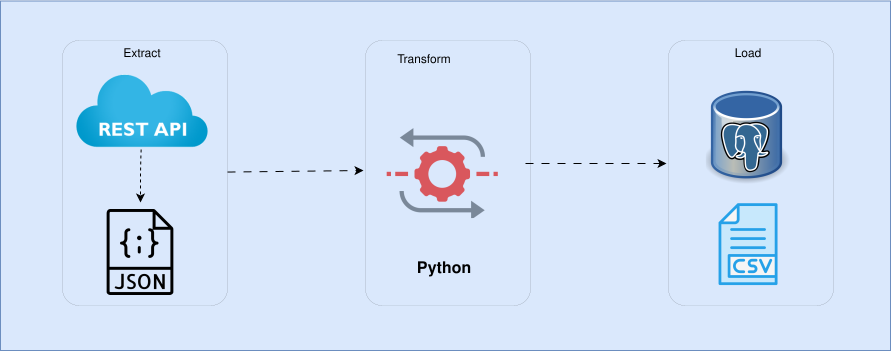

# Building ETL Pipeline with Python

This repository houses the scripts and methodologies used in building an **Extract Transform Load (ETL)** pipeline from a countries API. This data forms the foundation for recommending travel destinations to customers based on factors such as: Continent & Region, Languages, Currency and other attributes. 

---

## Table of Contents

- [Overview](#overview)
- [Features](#features)
- [Architecture Flow](#architecture-flow)
- [Project Structure](#project-structure)
- [Technologies Used](#technologies-used)
- [Project Setup](#project-setup)
    - [Prerequisites](#prerequisites)
    - [Installation](#installation)
    - [Environment Variables](#environment-variables)
- [How it works](#how-it-works)
- [Usage](#Usage)
- [Logging](#logging)
- [Future Enhancement](#future-enhancement)
- [Resources](#resources)

---

## Overview

The goal of this ETL pipeline is to extract country data from the API, transform it into a clean, structured format, and load it into a PostgreSQL database for downstream analytics and recommendation systems.
- It extracts country data from the [REST Countries API](https://restcountries.com/v3.1/all), 
- cleans and transforms the data, such as creating a standard calling code, add a column that counts languages spoken in each country, and 
- loads into a postgeSQL database for storage and further analysis.

---

## Features

- Extracts countries data/information using the countries API
- Cleans and transforms the data
- Loads the clean data to a postgres database and csv for further analysis
- Modular and configurable pipeline using environment variables for replication

---

## Architecture Flow



---

## Project Structure

```bash
etl-pipeline-with-python/
│
├── src/
│   ├── extract.py
│   ├── transform.py
│   ├── load.py
│   └── main.py
│
├── data/
|   └─── raw_countries_data.json
├── pipeline.log
├── requirements.txt
└── README.md
```
---

## Technologies Used

Python: Main programming language
Pandas: For data cleaning and manipulation
Requests: For API calls
PostgreSQL: For loading data into database

---

## Project Setup
---
### Prerequisites
Before running the project, make sure you have the following:
1. Python 3.8 or higher installed on your system
2. PostgreSQL installed on your system
3. pip to install Python dependencies from requirements.txt.
4. A code editor like VS Code or Sublime Text to write and run Python scripts.

### Installation

1. Clone the repo

```bash
https://github.com/mumi-nah/etl-pipeline-with-python.git
cd etl-pipeline-with-python
```

2. Install the required dependencies

```bash
pip install -r requirements.txt
```

### Environment Variables
create a .env file and add the following:

```bash
API_URL=https://restcountries.com/v3.1/all?fields=name,independent,unMember,idd,region,subregion,languages,area,population,continents
FILEPATH=your_filepath

DB_USER=your_username
DB_PASSWORD=your_password
DB_HOST=localhost
DB_PORT=5432
DB_NAME=database_name
```
Replace `your_filepath`, `your_username`, `your_password` and `database_name` with your actual credentaials.

---

## How it works

**Extract**

- Calls the REST Countries API.
- Saves raw JSON to `data/raw_countries_data.json` or any specified path.

**Transform**

- Flattens nested fields (common and official name, languages, idd, etc.).
- Cleans suffixes and continents.
- Adds `lang_count` and `calling_code`.

**Load**

- Connects to PostgreSQL using environment variables.
- Loads the cleaned DataFrame into a `countries` table.
- Optionally saves a CSV copy.

---

## Usage
- Activate your virtual environment (IDE)
- Ensure your .env file contains your countries API url, file path and postgres credentials.
- Run the ETL scripts 

```
src.extract()
src.transform()
src.load()
```
Open postgreSQL to confirm the data has been loaded correctly.

---

### Logging

All pipeline activitiy is logged in pipeline.log

```bash
2026-02-16 22:30: INFO: Data successfully saved to raw_countries_data.json
2026-02-16 22:31: INFO: Data transformed successfully!
2026-02-16 22:32: INFO: Data loaded into Postgres successfully
```

# Future Enhancement
Integrate visualization tools to create dashboards from the extracted data. 

## Resources

[Rest Countries API](https://restcountries.com/v3.1/all)
